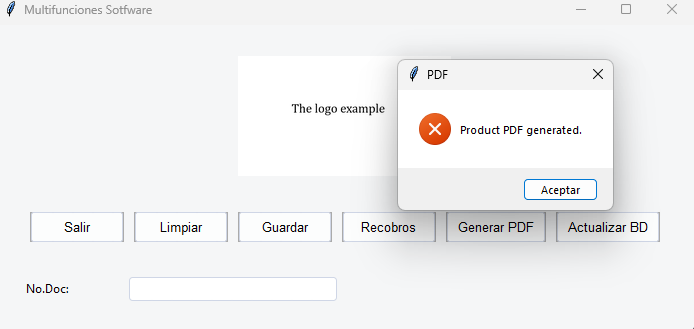
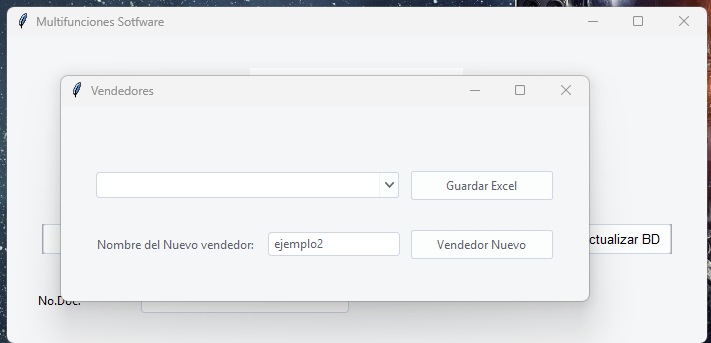
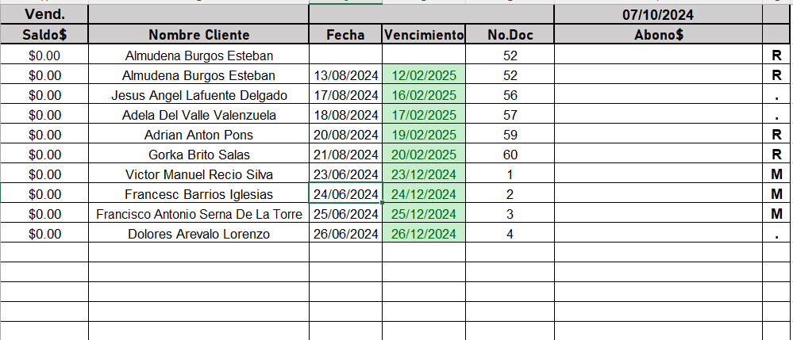

# UtilidadesSoftware

**Description:** UtilidadesSoftware is a Python desktop application that simplifies business management by automating the generation of product catalogs in PDF, updating data in the cloud for a mobile application (Android), and managing customer credit.

***

## 1. Introduction

UtilidadesSoftware is a Python desktop application created to solve a specific business problem. Aiming to simplify business process management, it automates essential tasks such as:

* **Product catalog creation:** Automatically generates PDF catalogs from your database information, including your company logo.
* **Cloud data update:** Uploads and updates product and customer information to Firebase Storage to be available in your mobile application (Android).
* **Credit control management:** Implements part of the business credit control logic, facilitating the management of customer debt.

This project can be taken as a case study. I invite you to review the code, run tests (it is quite functional!), and focus on how the logic of the functions works and the theory put into practice. You can use this project as inspiration to generate your own solutions. 

I hope it serves you well.

***

## 2. Installation

**Requirements:**

* Windows operating system.
* Python 3.x.
* Microsoft Access Database Engine 2010 (to interact with the Access database).

**Steps:**

1. **Clone the repository:** Download the project source code from GitHub.
2. **Install the dependencies:** Install the necessary libraries for the application to function correctly. This can be done using the `requirements.txt` file.
3. **Configure the database connection:** Modify the `config.py` file to indicate the location of your Access database and adjust the SQL queries if necessary.

**Firebase Configuration:**

If you intend to **test the application independently**, it is not necessary to configure Firebase. The application will generate the files `ClientesA.txt` and `ProductosA.txt` in the project's root folder, allowing you to analyze the logic used to process the data.

If you want to **test the integration with the Android application**, you can follow these steps:

4. **Firebase Configuration (optional):**
    * Create a project in Firebase.
    * Enable Firestore.
    * Register your Android application.
    * Download the configuration file (`google-services.json`).
    * Rename this file to `clave.json` and place it in the project's root directory.

**Alternative to test integration with the Android application:**

If you do not want to configure Firebase, you can copy the generated `ClientesA.txt` and `ProductosA.txt` files from the root folder to the following path in the Android application (available in this GitHub repository: [] I will be uploading it in the coming days): `[Aplicacion_V1_muestra\app\src\main\res\raw]`.

## 3. Usage

* **Run the application:** Open the application by running the `main.py` file.
* **Generate product catalog:** Click the "Generate PDF" button in the application. The generated catalog will be saved in the `recursos/pdf/` folder.
* **Update data in the cloud:** Click the "Update Database" button.
    * If you have configured Firebase, the updated files (`ClientesA.txt` and `ProductosA.txt`) will be uploaded to Firebase Storage.
    * If you have not configured Firebase, the `ClientesA.txt` and `ProductosA.txt` files will be generated in the project's root folder.
* **Credit control:**
    * Enter the customer ID in the input field.
    * Click "Save Document" to open a window that allows you to select the seller.
    * Select the seller corresponding to the customer. The application will create a new Excel file (if it does not exist) in the seller's folder within `recursos/Vendedores/` and record the customer information in the file.
    * Use the "Clear Document" (to delete the Excel data) and "Recobros" (to add a collection to the customer) buttons as needed.

***

## 4. Project Structure

* `recursos/`: Contains the database (`Database.accdb`), Excel files (`Controldecredito.xlsx`), logos (`example.png`), etc.
* `src/`: Contains the application source code, organized in folders:
    * `controllers`: Contains the application logic.
    * `models`: Contains the classes that interact with the database, Excel files, and Firebase.
    * `views`: Contains the graphical user interface code.
    * `utils`: Contains utility functions.
    * `tests`: Contains tests for the code.

***

## 5. Screenshots

***

## 6. How to contribute

We would love to receive your contributions! You can collaborate in the following ways:

* Report bugs or suggest improvements by creating an "issue".

***

## 7. Contact

**Miguel Angel Ramos**

* Email: Marsparta@gmail.com
***