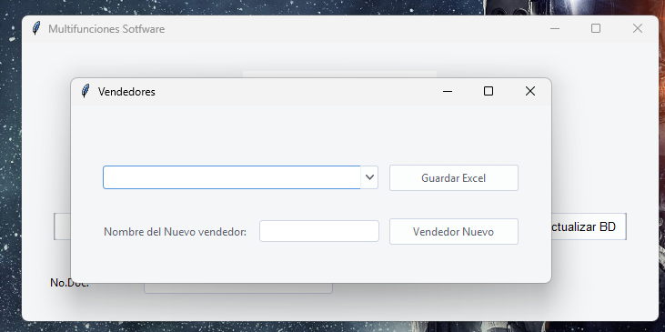

# UtilidadesSoftware

**Descripción:** UtilidadesSoftware es una aplicación de escritorio en Python que facilita la gestión de negocios al automatizar la generación de catálogos de productos en PDF, la actualización de datos en la nube para una aplicación móvil (Android) y el control de crédito de los clientes (enfocado en la gestión de [describe el problema específico que resuelve]).

***

## 1. Introducción

UtilidadesSoftware es una aplicación de escritorio en Python que nace con el propósito de resolver un problema específico de una empresa. Con la intención de simplificar la gestión de procesos de un negocio, automatiza tareas esenciales como:

*  **Creación de catálogos de productos:** Genera automáticamente catálogos en PDF a partir de la información de tu base de datos, incluyendo el logo de tu empresa.
*  **Actualización de datos en la nube:** Sube y actualiza información de productos y clientes a Firebase Storage para que esté disponible en tu aplicación móvil (Android).
*  **Gestión de control de crédito:** Implementa una parte de la lógica del control de crédito del negocio, facilitando la gestión de la deuda de los clientes.

Este proyecto puede tomarse como un caso de estudio. Te invito a revisar el código, hacer pruebas (¡es bastante funcional!) y centrarte en cómo funciona la lógica de las funciones y la teoría que se puso en práctica.  Puedes usar este proyecto como inspiración para generar tus propias soluciones. 

Espero que te sirva.

***
## 2. Instalación

**Requisitos:**

*   Sistema operativo Windows.
*   Python 3.x.
*   Microsoft Access Database Engine 2010 (para interactuar con la base de datos Access).

**Pasos:**

1.  **Clonar el repositorio:** Descarga el código fuente del proyecto desde GitHub.
2.  **Instalar las dependencias:** Instala las librerías necesarias para que la aplicación funcione correctamente. Esto se puede hacer utilizando el archivo `requirements.txt`.
3.  **Configurar la conexión a la base de datos:** Modifica el archivo `config.py` para indicar la ubicación de tu base de datos Access y ajustar las consultas SQL si es necesario.

**Configuración de Firebase:**

Si tu intención es **probar la aplicación de forma independiente**, no es necesario configurar Firebase. La aplicación generará los archivos `ClientesA.txt` y `ProductosA.txt` en la carpeta raíz del proyecto, permitiéndote analizar la lógica utilizada para procesar los datos.

Si deseas **probar la integración con la aplicación Android**, puedes seguir estos pasos:

4.  **Configuración de Firebase (opcional):** 
    *   Crea un proyecto en Firebase.
    *   Habilita Firestore.
    *   Registra tu aplicación Android.
    *   Descarga el archivo de configuración (`google-services.json`).
    *   Renombra este archivo a `clave.json` y colócalo en la raíz del proyecto. 

**Alternativa para probar la integración con la aplicación Android:**

Si no deseas configurar Firebase, puedes copiar los archivos `ClientesA.txt` y `ProductosA.txt` 
generados en la carpeta raíz a la siguiente ruta de la aplicación Android (disponible en este repositorio de GitHub: [] Lo entare subiendo en proximos dias ): `[Aplicacion_V1_muestra\app\src\main\res\raw]`.

## 3. Uso

*   **Ejecutar la aplicación:** Abre la aplicación ejecutando el archivo `main.py`.
*   **Generar catálogo de productos:** Haz clic en el botón "Generar PDF" en la aplicación. El catálogo generado se guardará en la carpeta `recursos/pdf/`.
*   **Actualizar datos en la nube:** Haz clic en el botón "Actualizar Base de Datos". 
    *   Si has configurado Firebase, los archivos actualizados (`ClientesA.txt` y `ProductosA.txt`) se subirán a Firebase Storage.
    *   Si no has configurado Firebase, los archivos `ClientesA.txt` y `ProductosA.txt` se generarán en la carpeta raíz del proyecto.
*   **Control de crédito:** 
    *   Ingresa el ID del cliente en el campo de entrada.
    *   Haz clic en "Guardar Documento" para abrir una ventana que te permitirá seleccionar el vendedor.
    *   Selecciona el vendedor correspondiente al cliente. La aplicación creará un nuevo archivo Excel (si no existe) en la carpeta del vendedor dentro de `recursos/Vendedores/` y registrará la información del cliente en el archivo.
    *   Utiliza los botones "Limpiar Documento" (para eliminar los datos del Excel) y "Recobros" (para añadir un recobro al cliente) según sea necesario.

***

## 4. Estructura del proyecto

*   `recursos/`: Contiene la base de datos (`Database.accdb`), archivos Excel (`Controldecredito.xlsx`), logos (`example.png`), etc.
*   `src/`: Contiene el código fuente de la aplicación, organizado en carpetas: 
    *   `controllers`: Contiene la lógica de la aplicación.
    *   `models`: Contiene las clases que interactúan con la base de datos, los archivos Excel y Firebase.
    *   `views`: Contiene el código de la interfaz gráfica de usuario.
    *   `utils`: Contiene funciones de utilidad.
    *   `tests`: Contiene pruebas para el código.

***

## 5. Capturas de pantalla

***

## 6. Cómo contribuir

¡Nos encantaría recibir tus contribuciones! Puedes colaborar de las siguientes maneras:

*  Reporta errores o sugiere mejoras creando un "issue".
***

## 7. Contacto

**Miguel Angel Ramos**

*  Correo electrónico: Marsparta@gmail.com
***

